# SQL Guidebook
This document compiles basic instructions on SQL querying for easy reference.

### Database Details
As an example, let's use the **Northwind SQL database**. I'm already familiar with this database as I used it in a previous course, so this will be an easy reference for me. I've used the PostgreSQL-compatible version of this database, which I [downloaded](https://github.com/pthom/northwind_psql) from the web.

### Document Outline and The SQL Workflow
When working with SQL querying, we typically have these things to do:
1. **Get our database:** Either build tables using `CREATE TABLE` or connect to an existing database in our environment
2. **Basic queries:** Examine the data, understand the schema, look at summary statistics. If needed, update the data wherever applicable
3. **Advanced querying based on use cases or questions:** Depending on the ask, spec, or use case we're trying to address, we use advanced SQL commands to analyze the dataset and generate output that can directly answer our questions (simple tables / views which include the metrics we're looking for, as opposed to long, complicated tables)
4. **Reporting -- typically outside the scope of SQL:** Once we've gotten good answers to our questions about the data using SQL, we can decide how to report them to our stakeholders or what actions to take further. This can involve data visualization, which is typically outside the scope of SQL querying, hence isn't included in this document.
5. **Appendix:** Towards the end of this document is a collection of more detailed and advanced commands for summary statistics and JOINs.


### Step 1: Connecting to database
To get the Northwind database, we can use **DBeaver**, which is a convenient tool for SQL querying. Other tools like VS Code can also be used with the appropriate extensions.

1. Navigate to the website containing the `.sql` script for the Northwind database and download the file into your working directory: https://github.com/pthom/northwind_psql
2. In DBeaver, connect to the PostgreSQL database using the 'Connect' button near the top left.
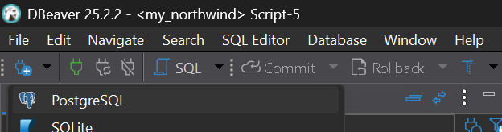

3. Once a connection is successful, right-click on the postgresql database to open a new SQL script and type the following command into it:
- How to make a new script:
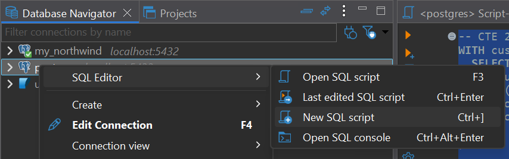

- command to type:
```sql
CREATE DATABASE my_northwind; -- or a db name of your choice
```
4. Execute this command to create a new database for Northwind. Now, refresh the postgresql database by right-clicking on it and hitting `Refresh`.
5. In order to connect to the downloaded Northwind database, open a new connection in the 'Connect' button on the top left. Here, enter the name `my_northwind` instead of postgresql. Remember to also provide the password you set up when installing PostgreSQL on your machine. 
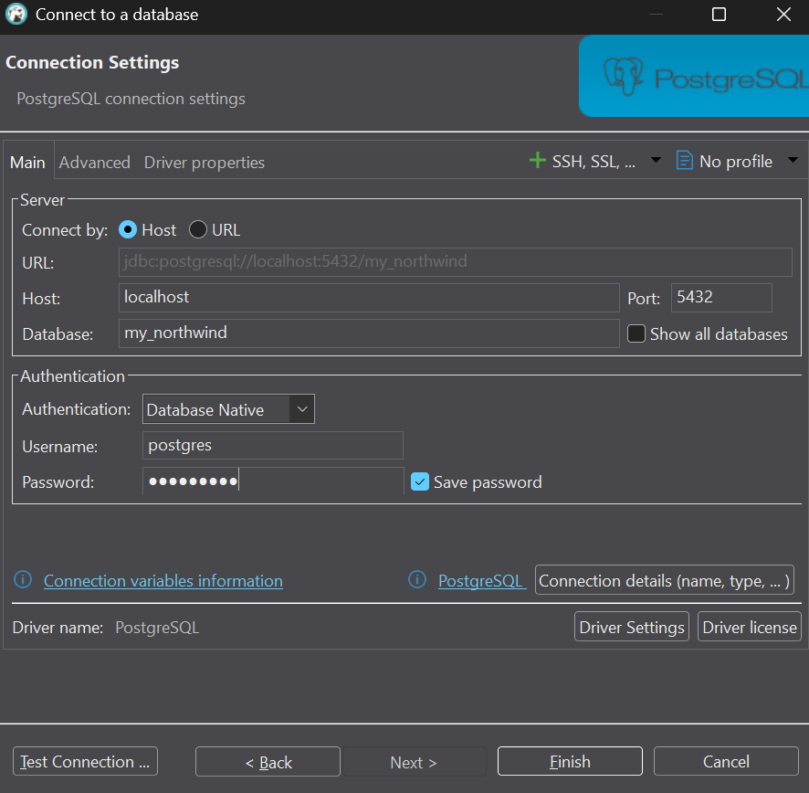
- Note: If you realize that you don't have that application, install it first according to the instructions [here](https://www.datacamp.com/tutorial/installing-postgresql-windows-macosx). Then, repeat all of these steps.
6. You should see the `my_northwind` database appear in the tab on the left called 'Database Navigator'. Make sure it's connected successfully.
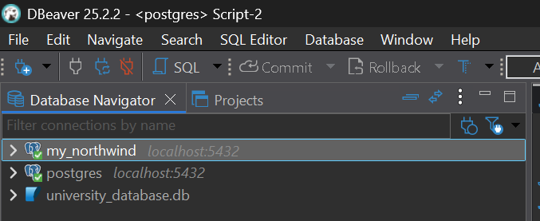
7.  Now right-click on the `my_northwind` database to open a new query, and copy-paste the content from the `.sql` file your downloaded from the website. Execute this file to populate the new database you just created. The screenshot below shows the script I opened and executed, titled `load_data.sql`.
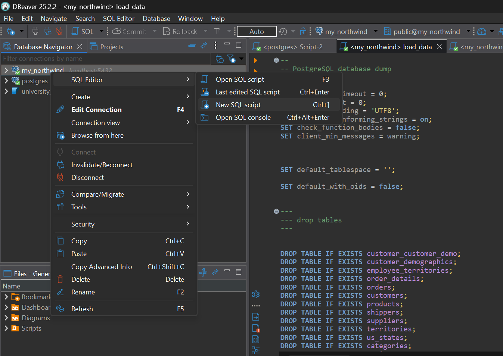
8. Refresh the database in the Database Navigator. Click on its components and dropdowns to see newly created tables!
  
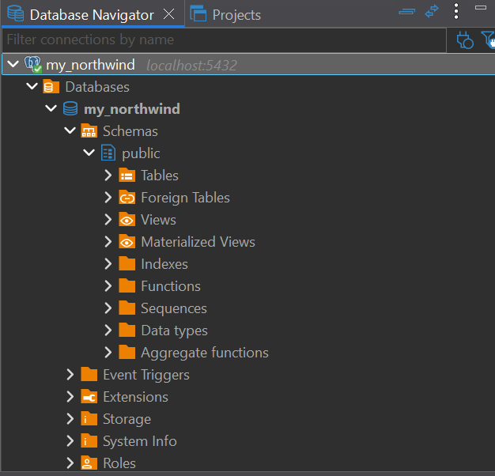
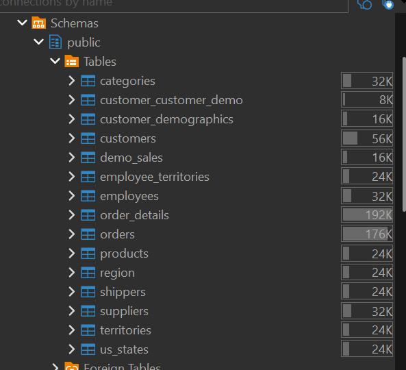


### Step 2: Basic Querying

### 1. Creating a new table, inserting values, and updating values
Let's create a table `demo_sales` as an example. We specify column names and their data types. It's also important to specify if a column can contain null values or not -- this determines if it can be used as a key, among other things for data validation! 

The screenshot following each query shows the results we get.

```sql
CREATE TABLE demo_sales (
    demo_id        SERIAL PRIMARY KEY,
    product_id     INTEGER      NOT NULL,
    sale_date      DATE         NOT NULL,
    quantity       INTEGER      NOT NULL,
    unit_price     NUMERIC(10,2) NOT NULL,
    region         TEXT
);
```
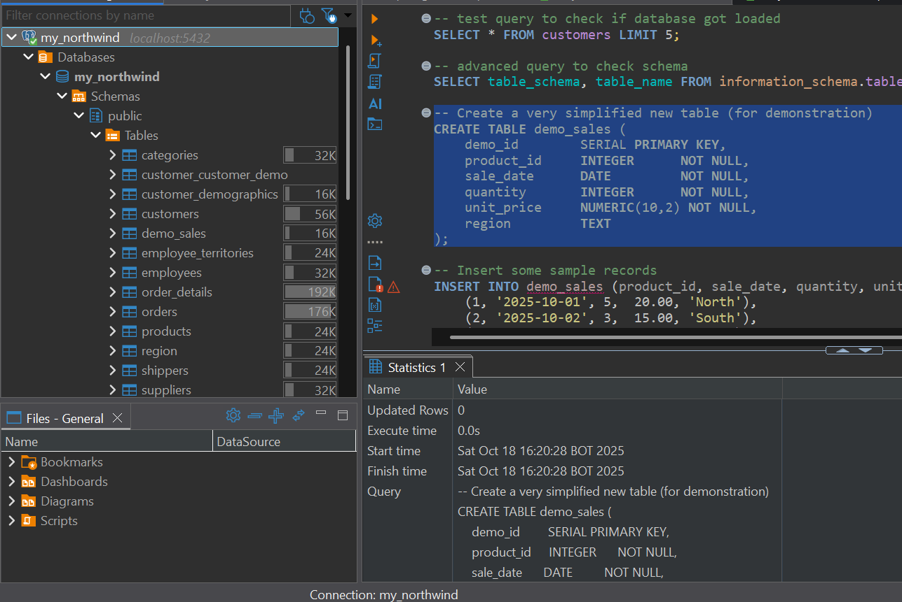

We can insert values into any table with `INSERT`. Here, we'll use the `demo_sales` table.

```sql
INSERT INTO demo_sales (product_id, sale_date, quantity, unit_price, region) VALUES
    (1, '2025-10-01', 5,  20.00, 'North'),
    (2, '2025-10-02', 3,  15.00, 'South'),
    (1, '2025-10-03', 2,  20.00, 'East'),
    (3, '2025-10-04', 10, 12.50, NULL);
```
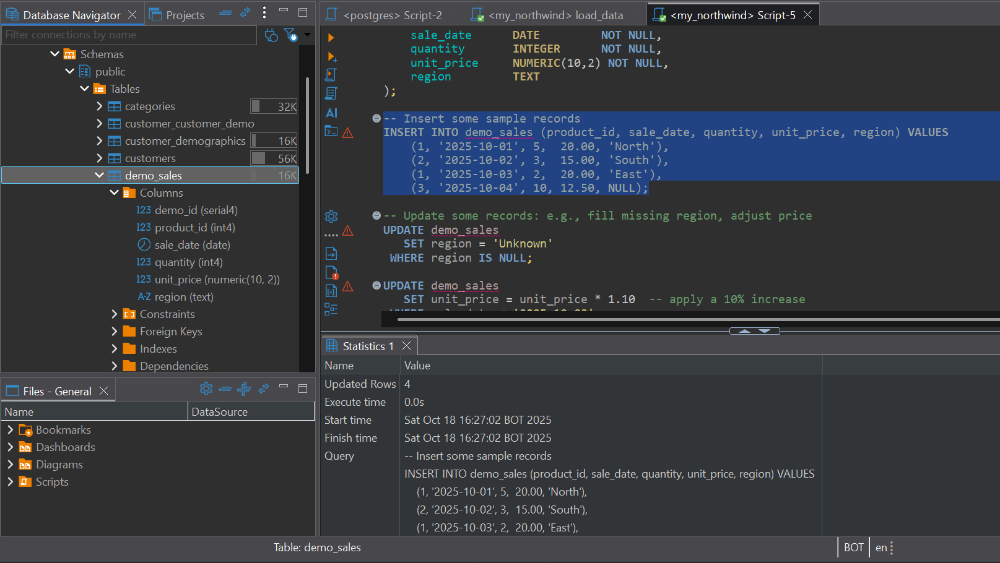

Let's check if the values got inserted correctly.
```sql
SELECT * FROM demo_sales;
```
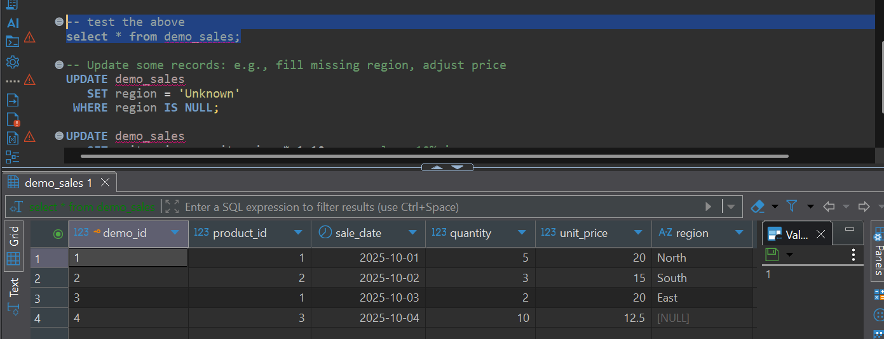

We can also modify existing values in tables using `UPDATE`. For example, let's change the null values in the region column of `demo_sales` to the string "Unknown".

```sql
UPDATE demo_sales
   SET region = 'Unknown'
 WHERE region IS NULL;

SELECT * FROM demo_sales
WHERE region = 'Unknown';
```
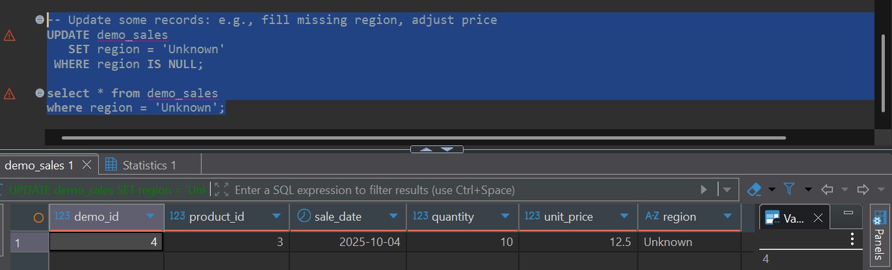


### 2. Viewing data using `SELECT`, `FROM`, `WHERE`, `ORDER BY`, `GROUP BY`, `LIMIT`, `HAVING`
To just all view the data from a table(s), use `SELECT * FROM table_name`.

```sql
SELECT  *
FROM customers;
```
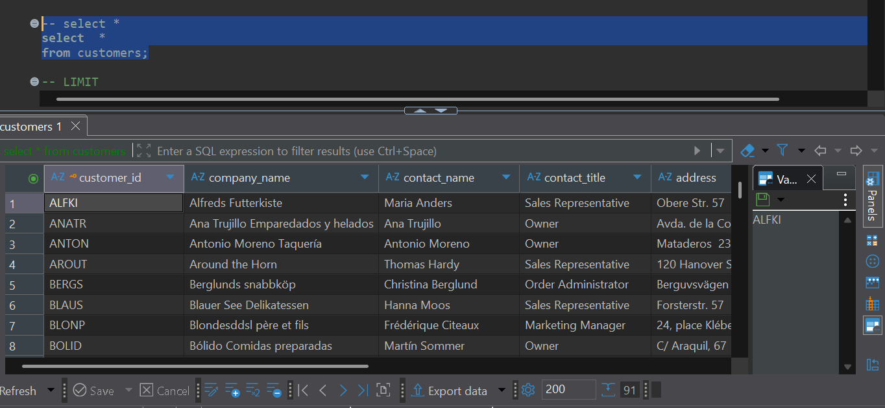

This is too long, we can hardly look at all rows. To select only the first few rows, use `LIMIT`.

```sql
SELECT  *
FROM customers
LIMIT 10;
```
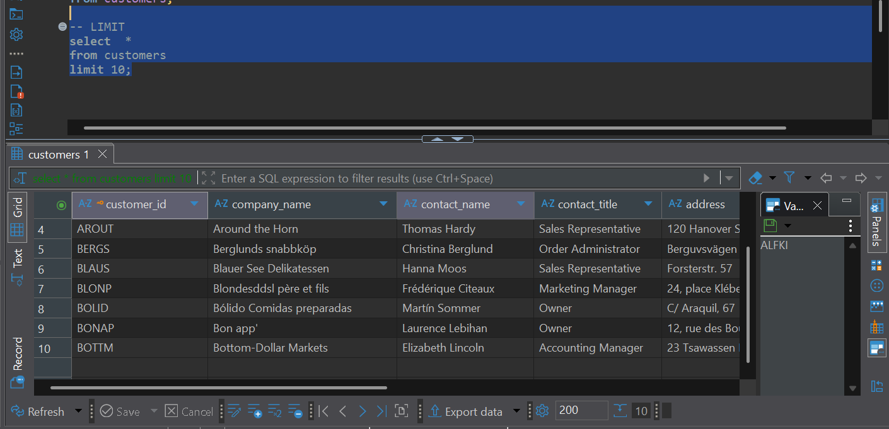

To select with more conditions, use the following commands:

- `WHERE`: choose rows based on a condition, such as numeric or boolean
- `ORDER BY`: decide the sequence of output rows based on a different condition. Specify ascending or descending order using `ASC` or `DESC`.

```sql
-- Basic SELECT with FROM + WHERE + ORDER BY  
SELECT product_id, sale_date, quantity, unit_price, region
  FROM demo_sales
 WHERE quantity >= 3
 ORDER BY sale_date DESC;
```
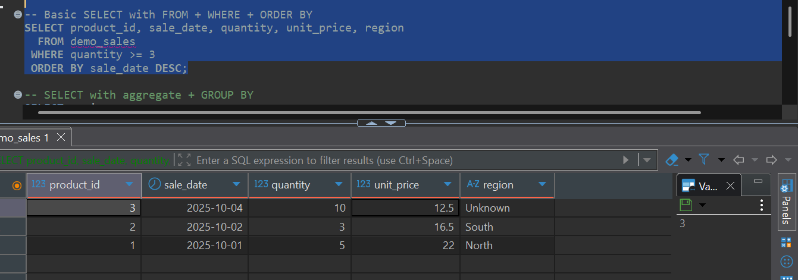

- Aggregate functions for summary statistics:
    - `COUNT()`: Returns the number of rows that match a specified criterion.
    - `SUM()` Calculates the sum of all values in a numeric column.
    - `AVG()` Calculates the average of all values in a numeric column.
    - `MIN()` Returns the smallest value in a column.
    - `MAX()` Returns the largest value in a column.
    - More statistical functions, such as Std Deviation, are compiled in the [Appendix](#appendix) for reference.

Below is an example query.

```sql
SELECT region,
       COUNT(*)     AS num_sales,
       SUM(quantity) AS total_qty,
       MAX(quantity) as max_qty,
       AVG(unit_price) AS avg_price
  FROM demo_sales
 GROUP BY region
 ORDER BY total_qty DESC;
```
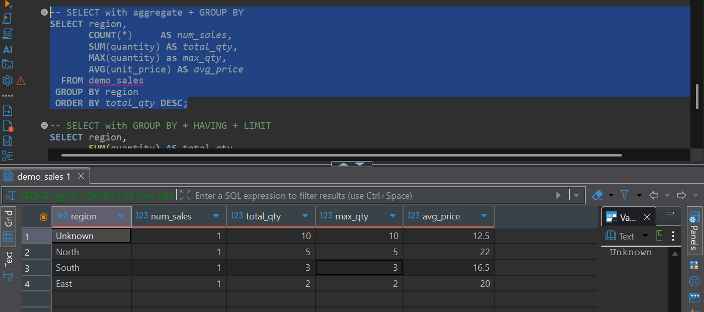

Selecting with `HAVING` is different from `WITH` that was shown above:
- `WHERE` clause filters individual rows before any grouping or aggregation occurs. It operates directly on the columns of the tables involved in the query.
- `HAVING` clause filters groups of rows after the GROUP BY clause has aggregated them. It operates on the results of aggregate functions.

```sql
-- SELECT with GROUP BY + HAVING + LIMIT  
SELECT region,
       SUM(quantity) AS total_qty
  FROM demo_sales
 GROUP BY region
 HAVING SUM(quantity) > 5
 ORDER BY total_qty DESC
 LIMIT 3;
```
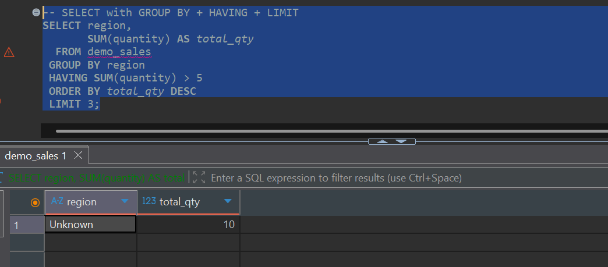

### JOINs: An important step towards Advanced Querying
**Concept:** Joins allow us to view information from multiple tables in a single table. The basic principle of *Relational* Databases is that the schema contains multiple tables with information that is linked to each other in some logical way. The separation of tables is important to storing data consistently and efficiently. But when we analyze it, we need to look at interrelatioships and dependencies more closely. Joins are the most fundamental way to do that.

**Types of Joins:** Inner, Outer, Right, and Left are the most basic types of joins. More types are compiled in the [Appendix](#appendix).

**Examples**
- Inner Join: Show only the rows that are matching on the specified column.
```sql
-- INNER JOIN: only matching rows  
SELECT o.order_id,
       o.order_date,
       c.customer_id,
       c.company_name,
       od.product_id,
       p.product_name,
       od.quantity
  FROM orders AS o
  INNER JOIN customers AS c  ON o.customer_id = c.customer_id
  INNER JOIN order_details AS od ON od.order_id = o.order_id
  INNER JOIN products AS p   ON od.product_id = p.product_id
 WHERE o.order_date >= '1997-01-01'
 ORDER BY o.order_date;
```
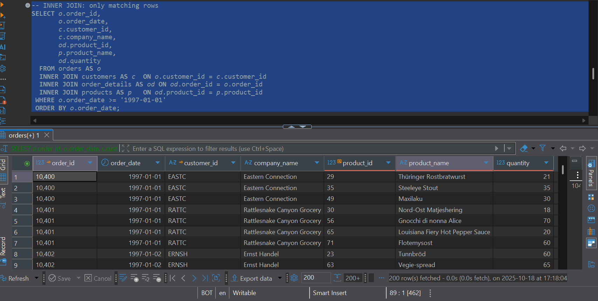

- Left Join: Show all rows from the table specified on the left (first), and those rows from the other table which do match.
```sql
-- LEFT JOIN: all from left side, even if no match on right  
SELECT p.product_id,
       p.product_name,
       s.supplier_id,
       s.company_name AS supplier_name
  FROM products AS p
  LEFT JOIN suppliers AS s ON p.supplier_id = s.supplier_id
 ORDER BY p.product_name;
```
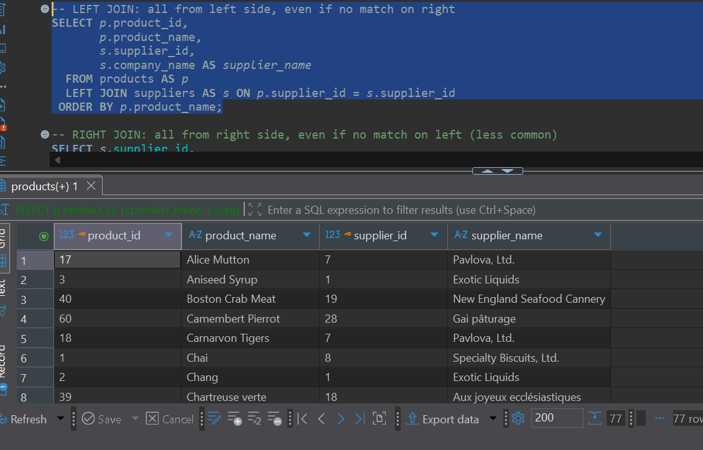

- Right Join: Show all rows from the table specified on the right (second), and those rows from the other table which do match.
```sql
-- RIGHT JOIN: all from right side, even if no match on left (less common)  
SELECT s.supplier_id,
       s.company_name AS supplier_name,
       p.product_id,
       p.product_name
  FROM products AS p
  RIGHT JOIN suppliers AS s ON p.supplier_id = s.supplier_id
 ORDER BY s.company_name;
```
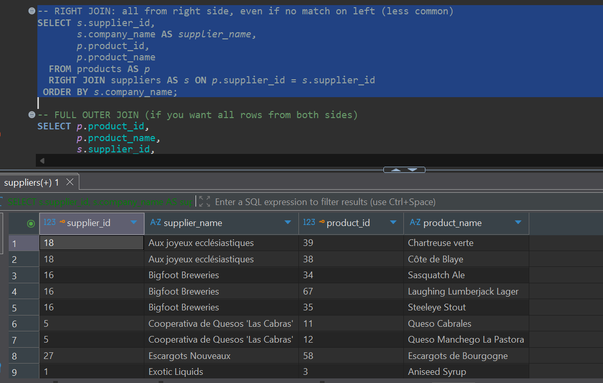


- Outer Join: Show all rows from both tables by displaying matching as well as null for non-matching values.
```sql
-- OUTER JOIN (if you want all rows from both sides)  
SELECT p.product_id,
       p.product_name,
       s.supplier_id,
       s.company_name AS supplier_name
  FROM products AS p
  FULL OUTER JOIN suppliers AS s ON p.supplier_id = s.supplier_id
 ORDER BY supplier_name NULLS LAST;
```
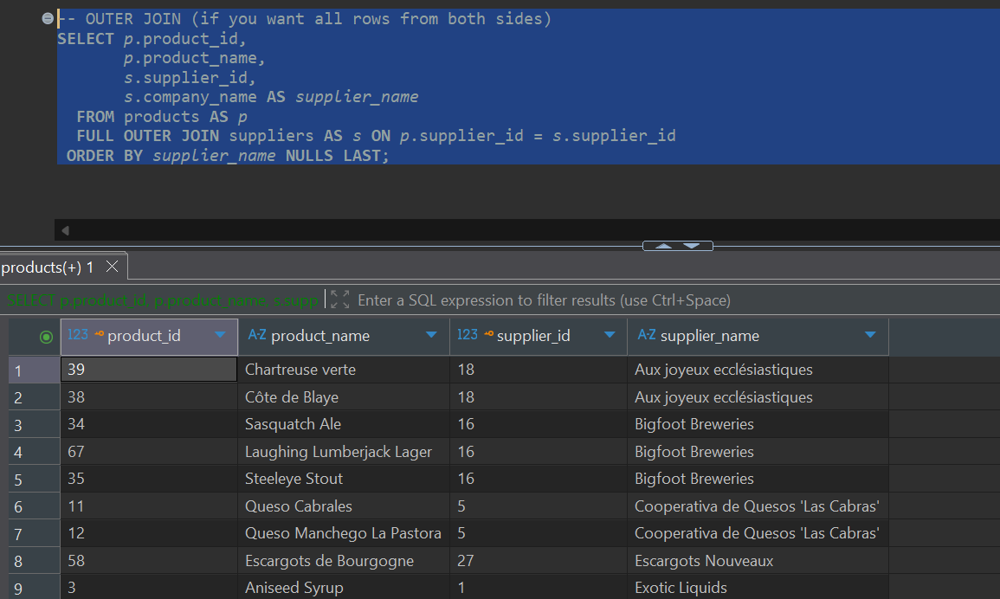


### Step 3: Advanced Querying

### Data Transformation examples
- Case When
This is for conditional selection and aggregation: specifying new ways to categorize or represent the data based on some conditions.

```sql
-- case when
SELECT 
  product_id,
  product_name,
  unit_price,
  CASE 
    WHEN unit_price >= 100 THEN 'Premium'
    WHEN unit_price >= 50 THEN 'Mid-range'
    ELSE 'Budget'
  END AS price_category
FROM products
ORDER BY unit_price DESC
LIMIT 10;
```
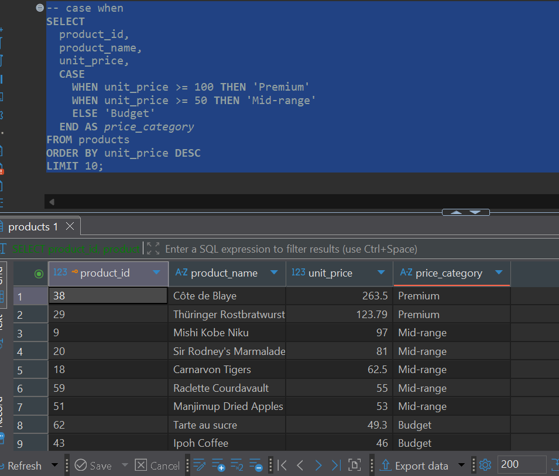

- COALESCE: Returns the first non-NULL value in a list of expressions.

```sql
SELECT 
  customer_id,
  company_name,
  COALESCE(region, 'Unknown') AS customer_region
FROM customers
ORDER BY customer_id
LIMIT 10;
```
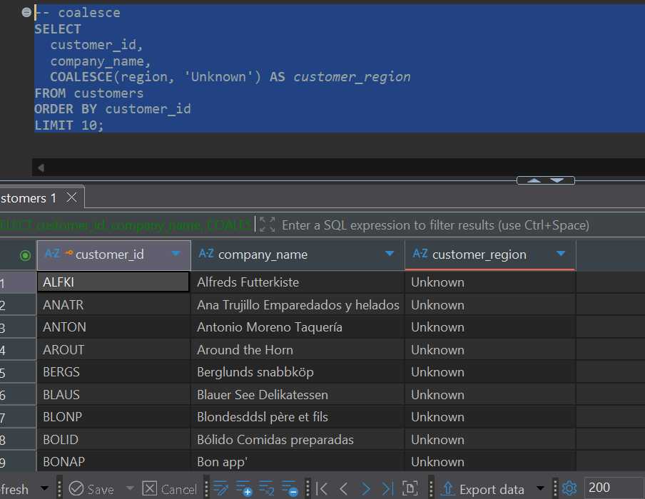

- UNION: Combines the result sets of two or more SELECT statements and removes duplicates.

```sql
SELECT 
  customer_id,
  company_name,
  'USA' AS country
FROM customers
WHERE country = 'USA'

UNION

SELECT 
  customer_id,
  company_name,
  'Canada' AS country
FROM customers
WHERE country = 'Canada';
```
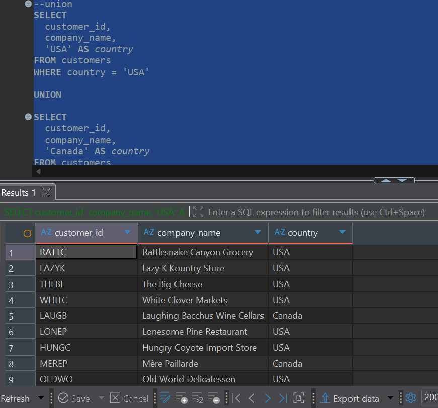

- EXCEPT: Returns rows from the first query that are not present in the second query.

```sql
-- except
-- All customers who have placed orders
SELECT DISTINCT o.customer_id
FROM orders o

EXCEPT

-- USA-based customers who have placed orders
SELECT DISTINCT o.customer_id
FROM orders o
JOIN customers c ON o.customer_id = c.customer_id
WHERE c.country = 'USA';
```
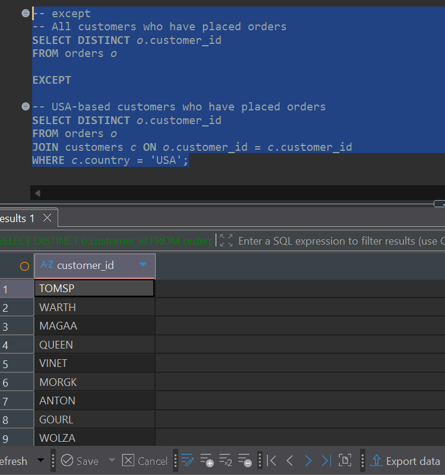


### Other Important Advanced Commands
- **Window Functions:** These perform calculations across a set of rows related to the current row, without collapsing the result set (unlike `GROUP BY`). So, this is like performing an operation on each row using a loop, rather than running a summary function.

1. `ROW_NUMBER()` assigns a unique number to each row within a partition. `PARTITION_BY()` basically defines a criterion for sub-gropuing the data. We run window functions on these partitions.

The following example gives the first order placed by each customer.

```sql
-- row number window function
SELECT *
FROM (
  SELECT 
    customer_id,
    order_id,
    order_date,
    ROW_NUMBER() OVER (
      PARTITION BY customer_id 
      ORDER BY order_date
    ) AS row_num
  FROM orders
) AS ranked_orders
WHERE row_num = 1;
```
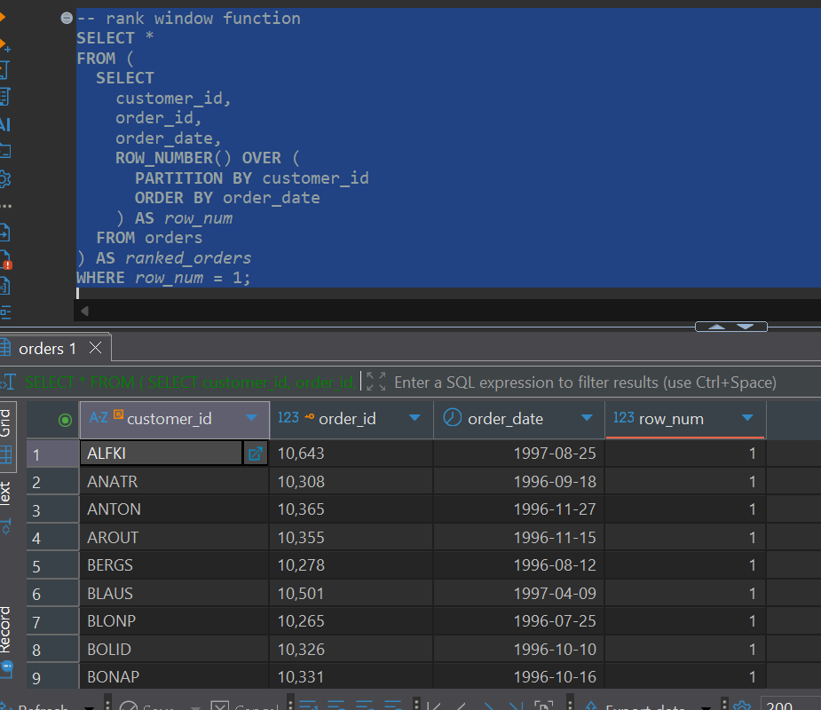

2. `RANK()` gives the same rank to tying rows, skipping numbers after duplicates. This is different from `ROW_NUMBER()` because ranks need not be unique; if two rows tie, they will get the same rank.

```sql
-- rank
SELECT 
  employee_id,
  SUM(od.unit_price * od.quantity) AS total_sales,
  RANK() OVER (ORDER BY SUM(od.unit_price * od.quantity) DESC) AS sales_rank
FROM orders o
JOIN order_details od ON o.order_id = od.order_id
GROUP BY employee_id;
```
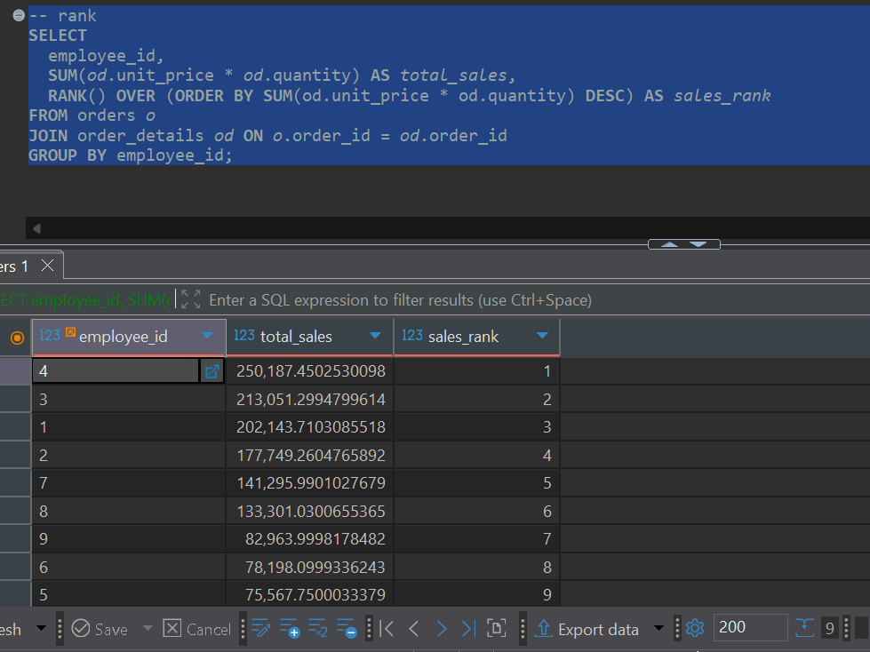

3. `PARTITION BY` with `OVER`splits the resulting set of rows into groups i.e. partitions. As mentioned above, partitions are central to window functions. This syntax will make such sub-groups and run any aggregate functions we wish to run on each of them.

We're still using `GROUP BY` and `ORDER BY` in the following query. This is for a diferent purpose: it first defines the way we want to extract data from `orders` and `customers` tables. Once we have that data, we use window functions to perform the desired operations. Hence, these two sets of commands still fulfill different goals.

```sql
-- partition by + over
SELECT 
  o.customer_id,
  o.order_id,
  SUM(od.unit_price * od.quantity) AS order_total,
  SUM(od.unit_price * od.quantity) * 100.0 /
    SUM(SUM(od.unit_price * od.quantity)) OVER (PARTITION BY o.customer_id) AS pct_of_customer_total
FROM orders o
JOIN order_details od ON o.order_id = od.order_id
GROUP BY o.customer_id, o.order_id
ORDER BY o.customer_id, order_total DESC;
```
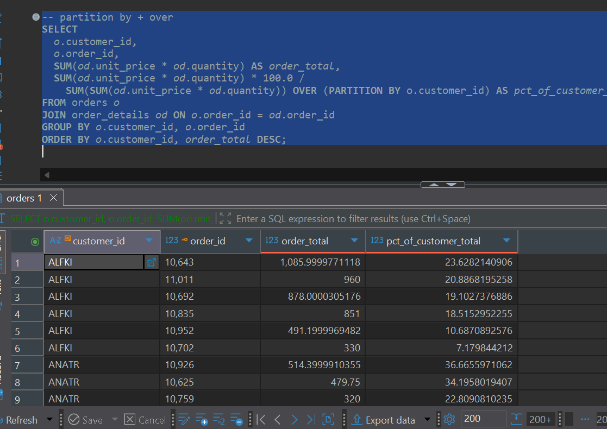


- **Common Table Expressions (CTEs)**
These felp us break down complex queries into smaller chunks. We can also look at these as simple ways to cobine various queries as though they were separate code blocks. While combining, it's common practice to label one chunk of results as an alias table and re-use it in the next chunk of query. The main syntax is `WITH alias_table_name AS`.

```sql
WITH customer_sales AS (
  SELECT 
    o.customer_id,
    SUM(od.unit_price * od.quantity) AS total_spent
  FROM orders o
  JOIN order_details od ON o.order_id = od.order_id
  GROUP BY o.customer_id
)

SELECT 
  customer_id,
  total_spent
FROM customer_sales
ORDER BY total_spent DESC
LIMIT 5;
```
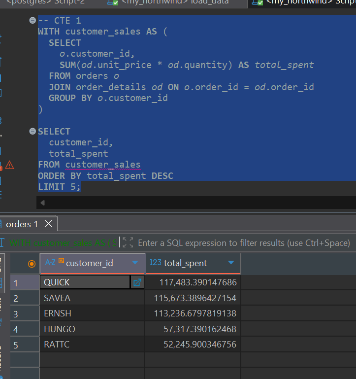

Since CTEs are all about combinig query logic, we can use them to combine queries that contain other advanced commands too, such as the Window Functions example below:


```sql
WITH customer_sales AS (
  SELECT 
    o.customer_id,
    SUM(od.unit_price * od.quantity) AS total_spent
  FROM orders o
  JOIN order_details od ON o.order_id = od.order_id
  GROUP BY o.customer_id
)

SELECT 
  customer_id,
  total_spent,
  RANK() OVER (ORDER BY total_spent DESC) AS spending_rank
FROM customer_sales
ORDER BY spending_rank;

```
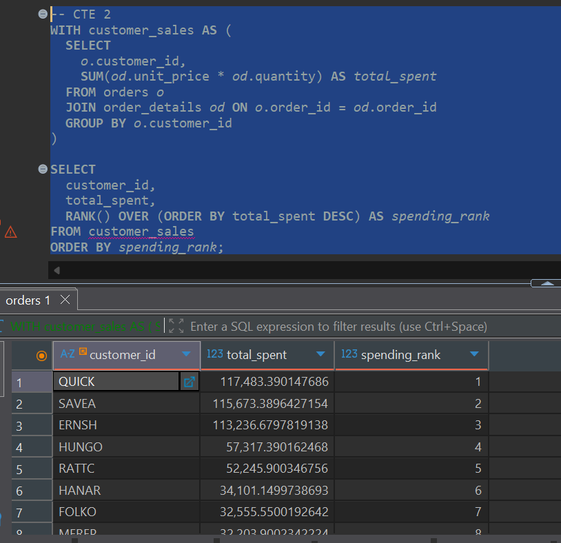


## Things to remember about SQL
- **Test the database connection before closing the connection setup window:** Spend enough time to ensure the database got connected correctly and avoid future problems.
- **Syntax:** Be sure to end each query with a semi-colon (;), use case-sensitive keywords and table names.
- **Keyword differences across SQL versions:** Things like `TOP` may not work in PostgreSQL, whereas `LIMIT` will. Google the syntax for such errors and practice to get used to them.
- **Order of Execution:** Like BODMAS in math, remember that SQL executes commands in a different sequence than the one in which the syntax is typed. Here's the order for reference, as shared with us in class:
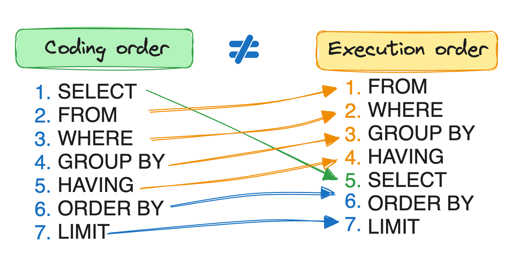
- **There are many more commands!** Like any other tool, SQL is an ocean of functionalities, but this guidebook describes the basic commands that will help us traverse almost any database with reasonable accuracy.

## Appendix
**More aggregate functions:**
- STDDEV_POP(expression): Calculates the population standard deviation.
- STDDEV_SAMP(expression): Calculates the sample standard deviation.
- VAR_POP(expression): Calculates the population variance.
- VAR_SAMP(expression): Calculates the sample variance.
- CORR(Y, X): Calculates the correlation coefficient between two sets of numeric values.
- COVAR_POP(Y, X): Calculates the population covariance between two sets of numeric values.
- COVAR_SAMP(Y, X): Calculates the sample covariance between two sets of numeric values.
- REGR_AVGX(Y, X): Calculates the average of the independent variable (X) in a linear regression.
- REGR_AVGY(Y, X): Calculates the average of the dependent variable (Y) in a linear regression.
- REGR_COUNT(Y, X): Counts the number of input pairs where both Y and X are non-null.
- REGR_INTERCEPT(Y, X): Calculates the y-intercept of the least-squares fit line.
- REGR_R2(Y, X): Calculates the coefficient of determination (R-squared).
- REGR_SLOPE(Y, X): Calculates the slope of the least-squares fit line.
- REGR_SXX(Y, X): Calculates the sum of squares of X (sum(X^2) - sum(X)^2/N).
- REGR_SXY(Y, X): Calculates the sum of products of X and Y (sum(X*Y) - sum(X)*sum(Y)/N).
- REGR_SYY(Y, X): Calculates the sum of squares of Y (sum(Y^2) - sum(Y)^2/N).

[Back_to_Aggregate_Functions](#2-viewing-data-using-select-from-where-order-by-group-by-limit-having)
[Top](#sql-guidebook)

**More Joins**
- Self Join: This involves joining a table to itself, treating it as two separate instances. It allows for comparing and combining rows within the same table based on specified column(s). For example, we could check if exmployees are also managers from the employees table.

- Cross Join: This gives us a Cartesian product of the two tables, i.e. it makes all possible combinations of all rows in the tables.

- Natural Join: This automatically matches columns with the same name in the two tables being joined. It eliminates the need to specify the join condition explicitly, assuming that column names and datatypes match accurately.

[Back_to_Joins](#joins-an-important-step-towards-advanced-querying)

[Top](#sql-guidebook)

